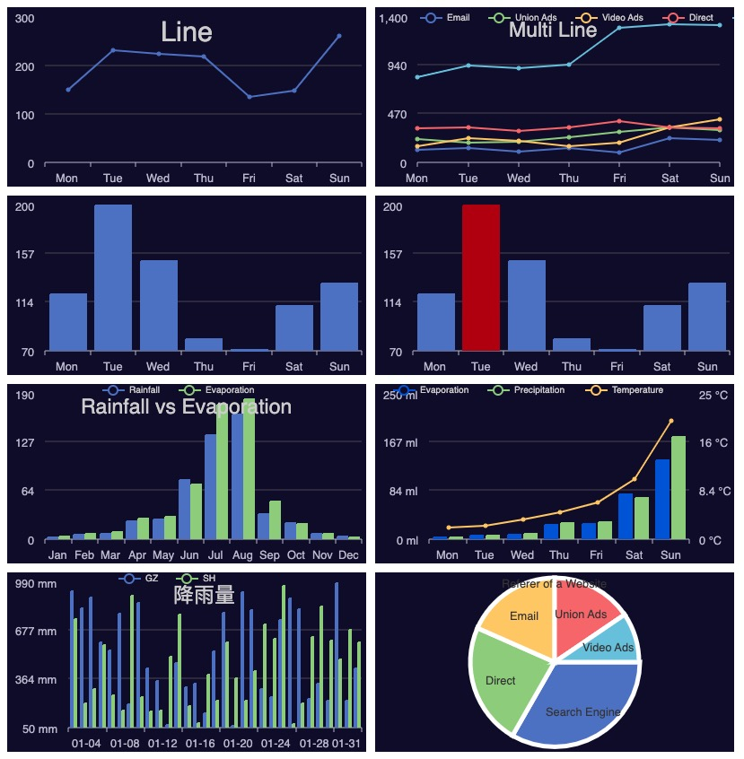

# go-echarts


[go-chart](https://github.com/wcharczuk/go-chart)是golang常用的可视化图表库，支持`svg`与`png`的输出，`Apache ECharts`在前端开发中得到众多开发者的认可。go-echarts则是结合两者的方式，兼容`Apache ECharts`的配置参数，简单快捷的生成相似的图表(`svg`或`png`)，方便插入至Email或分享使用。下面为常用的几种图表截图：



## 支持图表类型

暂仅支持三种的图表类型：`line`, `bar` 以及 `pie`


## 示例

`go-echarts`兼容了`echarts`的参数配置，可简单的使用json形式的配置字符串则可快速生成图表。

```go
package main

import (
	"os"

	charts "github.com/vicanso/echarts"
)

func main() {
	buf, err := charts.RenderEChartsToPNG(`{
		"title": {
			"text": "Line"
		},
		"xAxis": {
			"type": "category",
			"data": ["Mon", "Tue", "Wed", "Thu", "Fri", "Sat", "Sun"]
		},
		"series": [
			{
				"data": [150, 230, 224, 218, 135, 147, 260]
			}
		]
	}`)
	if err != nil {
		panic(err)
	}
	os.WriteFile("output.png", buf, 0600)
}
```