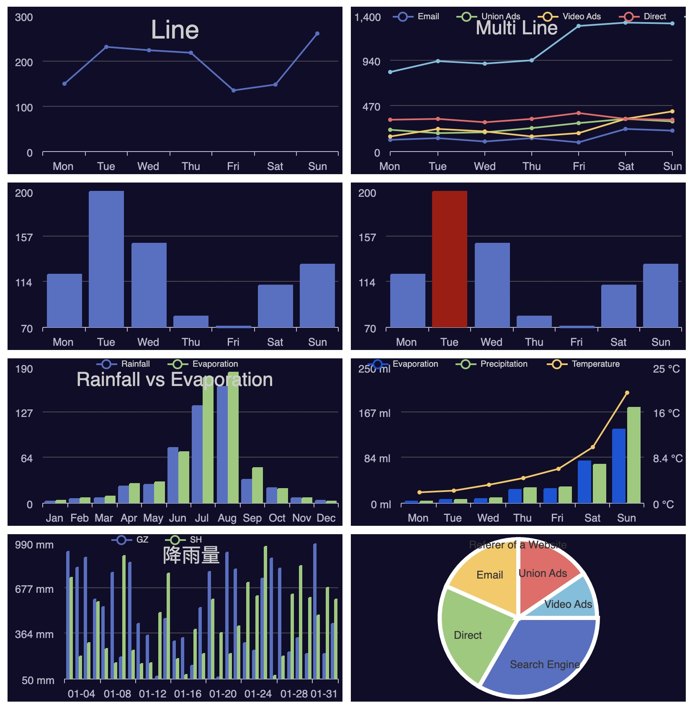

# go-echarts

[](https://github.com/vicanso/go-echarts/blob/master/LICENSE)
[](https://github.com/vicanso/go-echarts/actions)

`go-echarts`基于[go-chart](https://github.com/wcharczuk/go-chart)生成数据图表，支持`svg`与`png`的输出，`Apache ECharts`在前端开发中得到众多开发者的认可，`go-echarts`兼容`Apache ECharts`的配置参数，简单快捷的生成相似的图表(`svg`或`png`)，方便插入至Email或分享使用。下面为常用的几种图表截图(黑夜模式)：



## 支持图表类型

暂仅支持三种的图表类型：`line`, `bar` 以及 `pie`


## 示例

`go-echarts`兼容了`echarts`的参数配置，可简单的使用json形式的配置字符串则可快速生成图表。

```go
package main

import (
	"os"

	charts "github.com/vicanso/echarts"
)

func main() {
	buf, err := charts.RenderEChartsToPNG(`{
		"title": {
			"text": "Line"
		},
		"xAxis": {
			"type": "category",
			"data": ["Mon", "Tue", "Wed", "Thu", "Fri", "Sat", "Sun"]
		},
		"series": [
			{
				"data": [150, 230, 224, 218, 135, 147, 260]
			}
		]
	}`)
	if err != nil {
		panic(err)
	}
	os.WriteFile("output.png", buf, 0600)
}
```

## 参数说明

- `theme` 颜色主题，支持`dark`与`light`模式，默认为`light`
- `padding` 图表的内边距，单位px。支持以下几种模式的设置
  - `padding: 5` 设置内边距为5
  - `padding: [5, 10]` 设置上下的内边距为 5，左右的内边距为 10
  - `padding:[5, 10, 5, 10]` 分别设置`上右下左`边距
- `title` 图表标题，包括标题内容、高度、颜色等
  - `title.text` 标题内容
  - `title.textStyle.color` 标题文字颜色
  - `title.textStyle.fontSize` 标题文字字体大小
  - `title.textStyle.height` 标题高度
- `xAxis` 直角坐标系grid中的x轴，由于go-echarts仅支持单一个x轴，因此若参数为数组多个x轴，只使用第一个配置
  - `xAxis.boundaryGap` 坐标轴两边留白策略，仅支持三种设置方式`null`, `true`或者`false`。`null`或`true`时则数据点展示在两个刻度中间
  - `xAxis.splitNumber` 坐标轴的分割段数，需要注意的是这个分割段数只是个预估值，最后实际显示的段数会在这个基础上根据分割后坐标轴刻度显示的易读程度作调整
  - `xAxis.data` x轴的展示文案，暂只支持字符串数组，如["Mon", "Tue"]，其数量需要与展示点一致
- `yAxis` 直角坐标系grid中的y轴，最多支持两个y轴
  - `yAxis.min` 坐标轴刻度最小值，若不设置则自动计算
  - `yAxis.max` 坐标轴刻度最大值，若不设置则自动计算
  - `yAxis.axisLabel.formatter` 刻度标签的内容格式器，如`"formatter": "{value} kg"`
- `legend` 图表中不同系列的标记
  - `legend.data` 图例的数据数组，为字符串数组，如["Email", "Video Ads"]
  - `legend.align` 图例标记和文本的对齐，默认为标记靠左`left`
  - `legend.padding` legend的padding，配置方式与图表的`padding`一致
  - `legend.left` legend离容器左侧的距离，其值可以为具体的像素值(20)或百分比(20%)
  - `legend.right` legend离容器右侧的距离，其值可以为具体的像素值(20)或百分比(20%)
- `series` 图表的数据项列表
  - `series.type` 图表的展示类型，暂支持`line`, `bar`以及`pie`，需要注意`pie`只能单独使用
  - `series.yAxisIndex` 该数据项使用的y轴，默认为0，对yAxis的配置对应
  - `series.itemStyle.color` 该数据项展示时使用的颜色 
  - `series.data` 数据项对应的数据数组，支持以下形式的数据：
    - `数值` 常用形式，数组数据为浮点数组，如[1.1, 2,3, 5.2]
    - `结构体` pie图表或bar图表中指定样式使用，如[{"value": 1048, "name": "Search Engine"},{"value": 735,"name": "Direct"}]