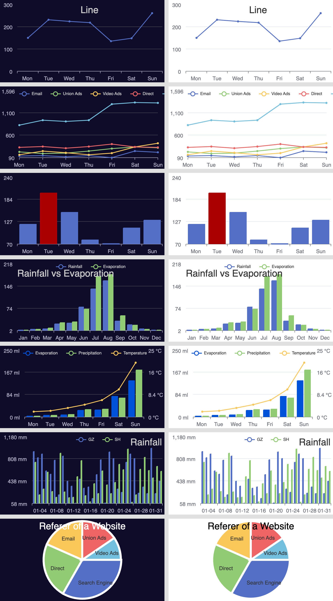
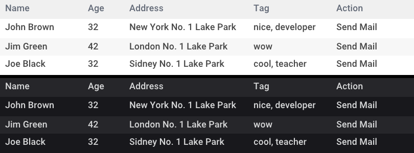

# go-charts

[](https://github.com/vicanso/go-charts/blob/master/LICENSE)
[](https://github.com/vicanso/go-charts/actions)

`go-charts`基于[go-chart](https://github.com/wcharczuk/go-chart)，更简单方便的形式生成数据图表，支持`svg`与`png`两种方式的输出，支持主题`light`, `dark`, `grafana`以及`ant`。默认的输入格式为`png`，默认主题为`light`。

`Apache ECharts`在前端开发中得到众多开发者的认可，因此`go-charts`提供了兼容`Apache ECharts`的配置参数，简单快捷的生成相似的图表(`svg`或`png`)，方便插入至Email或分享使用。下面为常用的图表截图(主题为light与grafana)：


<p align="center">
    
</p>

<p align="center">
    
</p

## 支持图表类型

支持以下的图表类型：`line`, `bar`,  `horizontal bar`, `pie`, `radar`, `funnel` 以及 `table`


## 示例


下面的示例为`go-charts`两种方式的参数配置：golang的参数配置、echarts的JSON配置，输出相同的折线图。
更多的示例参考：[./examples/](./examples/)目录

### Line Chart
```go
package main

import (
	charts "github.com/vicanso/go-charts/v2"
)

func main() {
	values := [][]float64{
		{
			120,
			132,
			101,
			134,
			90,
			230,
			210,
		},
		{
			// snip...
		},
		{
			// snip...
		},
		{
			// snip...
		},
		{
			// snip...
		},
	}
	p, err := charts.LineRender(
		values,
		charts.TitleTextOptionFunc("Line"),
		charts.XAxisDataOptionFunc([]string{
			"Mon",
			"Tue",
			"Wed",
			"Thu",
			"Fri",
			"Sat",
			"Sun",
		}),
		charts.LegendLabelsOptionFunc([]string{
			"Email",
			"Union Ads",
			"Video Ads",
			"Direct",
			"Search Engine",
		}, charts.PositionCenter),
	)

	if err != nil {
		panic(err)
	}

	buf, err := p.Bytes()
	if err != nil {
		panic(err)
	}
	// snip...
}
```

### Bar Chart

```go
package main

import (
	"github.com/vicanso/go-charts/v2"
)

func main() {
	values := [][]float64{
		{
			2.0,
			4.9,
			7.0,
			23.2,
			25.6,
			76.7,
			135.6,
			162.2,
			32.6,
			20.0,
			6.4,
			3.3,
		},
		{
			// snip...	
		},
	}
	p, err := charts.BarRender(
		values,
		charts.XAxisDataOptionFunc([]string{
			"Jan",
			"Feb",
			"Mar",
			"Apr",
			"May",
			"Jun",
			"Jul",
			"Aug",
			"Sep",
			"Oct",
			"Nov",
			"Dec",
		}),
		charts.LegendLabelsOptionFunc([]string{
			"Rainfall",
			"Evaporation",
		}, charts.PositionRight),
		charts.MarkLineOptionFunc(0, charts.SeriesMarkDataTypeAverage),
		charts.MarkPointOptionFunc(0, charts.SeriesMarkDataTypeMax,
			charts.SeriesMarkDataTypeMin),
		// custom option func
		func(opt *charts.ChartOption) {
			opt.SeriesList[1].MarkPoint = charts.NewMarkPoint(
				charts.SeriesMarkDataTypeMax,
				charts.SeriesMarkDataTypeMin,
			)
			opt.SeriesList[1].MarkLine = charts.NewMarkLine(
				charts.SeriesMarkDataTypeAverage,
			)
		},
	)
	if err != nil {
		panic(err)
	}

	buf, err := p.Bytes()
	if err != nil {
		panic(err)
	}
	// snip...
}
```

### Horizontal Bar Chart

```go
package main

import (
	"github.com/vicanso/go-charts/v2"
)

func main() {
	values := [][]float64{
		{
			18203,
			23489,
			29034,
			104970,
			131744,
			630230,
		},
		{
			// snip...	
		},
	}
	p, err := charts.HorizontalBarRender(
		values,
		charts.TitleTextOptionFunc("World Population"),
		charts.PaddingOptionFunc(charts.Box{
			Top:    20,
			Right:  40,
			Bottom: 20,
			Left:   20,
		}),
		charts.LegendLabelsOptionFunc([]string{
			"2011",
			"2012",
		}),
		charts.YAxisDataOptionFunc([]string{
			"Brazil",
			"Indonesia",
			"USA",
			"India",
			"China",
			"World",
		}),
	)
	if err != nil {
		panic(err)
	}

	buf, err := p.Bytes()
	if err != nil {
		panic(err)
	}
	// snip...
}
```

### Pie Chart

```go
package main

import (
	"github.com/vicanso/go-charts/v2"
)

func main() {
	values := []float64{
		1048,
		735,
		580,
		484,
		300,
	}
	p, err := charts.PieRender(
		values,
		charts.TitleOptionFunc(charts.TitleOption{
			Text:    "Rainfall vs Evaporation",
			Subtext: "Fake Data",
			Left:    charts.PositionCenter,
		}),
		charts.PaddingOptionFunc(charts.Box{
			Top:    20,
			Right:  20,
			Bottom: 20,
			Left:   20,
		}),
		charts.LegendOptionFunc(charts.LegendOption{
			Orient: charts.OrientVertical,
			Data: []string{
				"Search Engine",
				"Direct",
				"Email",
				"Union Ads",
				"Video Ads",
			},
			Left: charts.PositionLeft,
		}),
		charts.PieSeriesShowLabel(),
	)
	if err != nil {
		panic(err)
	}

	buf, err := p.Bytes()
	if err != nil {
		panic(err)
	}
	// snip...	
}
```

### Radar Chart

```go
package main

import (
	"github.com/vicanso/go-charts/v2"
)

func main() {
	values := [][]float64{
		{
			4200,
			3000,
			20000,
			35000,
			50000,
			18000,
		},
		{
			// snip...
		},
	}
	p, err := charts.RadarRender(
		values,
		charts.TitleTextOptionFunc("Basic Radar Chart"),
		charts.LegendLabelsOptionFunc([]string{
			"Allocated Budget",
			"Actual Spending",
		}),
		charts.RadarIndicatorOptionFunc([]string{
			"Sales",
			"Administration",
			"Information Technology",
			"Customer Support",
			"Development",
			"Marketing",
		}, []float64{
			6500,
			16000,
			30000,
			38000,
			52000,
			25000,
		}),
	)
	if err != nil {
		panic(err)
	}

	buf, err := p.Bytes()
	if err != nil {
		panic(err)
	}
	// snip...
}
```

### Funnel Chart

```go
package main

import (
	"github.com/vicanso/go-charts/v2"
)

func main() {
	values := []float64{
		100,
		80,
		60,
		40,
		20,
	}
	p, err := charts.FunnelRender(
		values,
		charts.TitleTextOptionFunc("Funnel"),
		charts.LegendLabelsOptionFunc([]string{
			"Show",
			"Click",
			"Visit",
			"Inquiry",
			"Order",
		}),
	)
	if err != nil {
		panic(err)
	}

	buf, err := p.Bytes()
	if err != nil {
		panic(err)
	}
	// snip...
}
```

### Table

```go
package main

import (
	"github.com/vicanso/go-charts/v2"
)

func main() {
	header := []string{
		"Name",
		"Age",
		"Address",
		"Tag",
		"Action",
	}
	data := [][]string{
		{
			"John Brown",
			"32",
			"New York No. 1 Lake Park",
			"nice, developer",
			"Send Mail",
		},
		{
			"Jim Green	",
			"42",
			"London No. 1 Lake Park",
			"wow",
			"Send Mail",
		},
		{
			"Joe Black	",
			"32",
			"Sidney No. 1 Lake Park",
			"cool, teacher",
			"Send Mail",
		},
	}
	spans := map[int]int{
		0: 2,
		1: 1,
		// 设置第三列的span
		2: 3,
		3: 2,
		4: 2,
	}
	p, err := charts.TableRender(
		header,
		data,
		spans,
	)
	if err != nil {
		panic(err)
	}

	buf, err := p.Bytes()
	if err != nil {
		panic(err)
	}
	// snip...
}
```
### ECharts Render

```go
package main

import (
	"github.com/vicanso/go-charts/v2"
)

func main() {
	buf, err := charts.RenderEChartsToPNG(`{
		"title": {
			"text": "Line"
		},
		"xAxis": {
			"data": ["Mon", "Tue", "Wed", "Thu", "Fri", "Sat", "Sun"]
		},
		"series": [
			{
				"data": [150, 230, 224, 218, 135, 147, 260]
			}
		]
	}`)
	// snip...
}
```

## 常用函数

`go-charts`针对常用的几种图表提供了简单的调用方式以及几种常用的Option设置，便捷的生成常用图表。

- `LineRender`: 折线图表，第一个参数为二维浮点数，对应图表中的点，支持不定长的OptionFunc参数，用于指定其它的属性
- `BarRender`: 柱状图表，第一个参数为二维浮点数，对应柱状图的高度，支持不定长的OptionFunc参数，用于指定其它的属性
- `PieRender`: 饼图表，第一个参数为浮点数数组，对应各占比，支持不定长的OptionFunc参数，用于指定其它的属性
- `RadarRender`: 雷达图，第一个参数为二维浮点数，对应雷达图中的各值，支持不定长的OptionFunc参数，用于指定其它的属性
- `FunnelRender`: 漏斗图，第一个参数为浮点数数组，对应各占比，支持不定长的OptionFunc参数，用于指定其它的属性
- `PNGTypeOption`: 指定输出PNG
- `FontFamilyOptionFunc`: 指定使用的字体
- `ThemeOptionFunc`: 指定使用的主题类型
- `TitleOptionFunc`: 指定标题相关属性
- `LegendOptionFunc`: 指定图例相关属性
- `XAxisOptionFunc`: 指定x轴的相关属性
- `YAxisOptionFunc`: 指定y轴的相关属性
- `WidthOptionFunc`: 指定宽度
- `HeightOptionFunc`: 指定高度
- `PaddingOptionFunc`: 指定空白填充区域
- `BoxOptionFunc`: 指定内容区域
- `ChildOptionFunc`: 指定子图表
- `RadarIndicatorOptionFunc`: 雷达图指示器相关属性
- `BackgroundColorOptionFunc`: 设置背景图颜色

## ECharts参数说明

名称有[]的参数非echarts的原有参数，为`go-charts`的新增参数，可根据实际使用场景添加。

- `[type]` 画布类型，支持`svg`与`png`，默认为`svg`
- `[theme]` 颜色主题，支持`dark`、`light`以及`grafana`模式，默认为`light`
- `[fontFamily]` 字体，全局的字体设置
- `[padding]` 图表的内边距，单位px。支持以下几种模式的设置
  - `padding: 5` 设置内边距为5
  - `padding: [5, 10]` 设置上下的内边距为 5，左右的内边距为 10
  - `padding:[5, 10, 5, 10]` 分别设置`上右下左`边距
- `[box]` 图表的区域，以{"left": Int, "right": Int, "top": Int, "bottom": Int}的形式配置
- `[width]` 画布宽度，默认为600
- `[height]` 画布高度，默认为400
- `title` 图表标题，包括标题内容、高度、颜色等
  - `title.text` 标题文本，支持以`\n`的形式换行
  - `title.subtext` 副标题文本，支持以`\n`的形式换行
  - `title.left` 标题与容器左侧的距离，可设置为`left`, `right`, `center`, `20%` 以及 `20` 这样的具体数值
  - `title.top` 标题与容器顶部的距离，暂仅支持具体数值，如`20`
  - `title.textStyle.color` 标题文字颜色
  - `title.textStyle.fontSize` 标题文字字体大小
  - `title.textStyle.fontFamily` 标题文字的字体系列，需要注意此配置是会影响整个图表的字体
- `xAxis` 直角坐标系grid中的x轴，由于go-charts仅支持单一个x轴，因此若参数为数组多个x轴，只使用第一个配置
  - `xAxis.boundaryGap` 坐标轴两边留白策略，仅支持三种设置方式`null`, `true`或者`false`。`null`或`true`时则数据点展示在两个刻度中间
  - `xAxis.splitNumber` 坐标轴的分割段数，需要注意的是这个分割段数只是个预估值，最后实际显示的段数会在这个基础上根据分割后坐标轴刻度显示的易读程度作调整
  - `xAxis.data` x轴的展示文案，暂只支持字符串数组，如["Mon", "Tue"]，其数量需要与展示点一致
- `yAxis` 直角坐标系grid中的y轴，最多支持两个y轴
  - `yAxis.min` 坐标轴刻度最小值，若不设置则自动计算
  - `yAxis.max` 坐标轴刻度最大值，若不设置则自动计算
  - `yAxis.axisLabel.formatter` 刻度标签的内容格式器，如`"formatter": "{value} kg"`
  - `yAxis.axisLine.lineStyle.color` 坐标轴颜色
- `legend` 图表中不同系列的标记
  - `legend.show` 图例是否显示，如果不需要展示需要设置为`false`
  - `legend.data` 图例的数据数组，为字符串数组，如["Email", "Video Ads"]
  - `legend.align` 图例标记和文本的对齐，可设置为`left`或者`right`，默认为标记靠左`left`
  - `legend.padding` legend的padding，配置方式与图表的`padding`一致
  - `legend.left` legend离容器左侧的距离，其值可以为具体的像素值(20)或百分比(20%)、`left`或者`right`
  - `legend.top` legend离容器顶部的距离，暂仅支持数值形式
- `radar` 雷达图的坐标系 
  - `radar.indicator` 雷达图的指示器，用来指定雷达图中的多个变量（维度）
    - `radar.indicator.name` 指示器名称
    - `radar.indicator.max` 指示器的最大值，可选，建议设置
    - `radar.indicator.min` 指示器的最小值，可选，默认为 0
- `series` 图表的数据项列表
  - `series.name` 图表的名称，与`legend.data`对应，两者只只设置其一
  - `series.type` 图表的展示类型，暂支持`line`, `bar`, `pie`, `radar` 以及 `funnel`。需要注意只有`line`与`bar`可以混用
  - `series.radius` 饼图的半径值，如`50%`，默认为`40%`
  - `series.yAxisIndex` 该数据项使用的y轴，默认为0，对yAxis的配置对应
  - `series.label.show` 是否显示文本标签(默认为对应的值)
  - `series.label.distance` 距离图形元素的距离
  - `series.label.color` 文本标签的颜色
  - `series.itemStyle.color` 该数据项展示时使用的颜色
  - `series.markPoint` 图表的标注配置
  - `series.markPoint.symbolSize` 标注的大小，默认为30
  - `series.markPoint.data` 标注类型，仅支持数组形式，其类型只支持`max`与`min`，如：`[{"type": "max"}, {"type": "min"}]
  - `series.markLine` 图表的标线配置 
  - `series.markPoint.data` 标线类型，仅支持数组形式，其类型只支持`max`、`min`以及`average`，如：`[{"type": "max"}, {"type": "min"}, {"type": "average"}]
  - `series.data` 数据项对应的数据数组，支持以下形式的数据：
    - `数值` 常用形式，数组数据为浮点数组，如[1.1, 2,3, 5.2]
    - `结构体` pie图表或bar图表中指定样式使用，如[{"value": 1048, "name": "Search Engine"},{"value": 735,"name": "Direct"}]
- `[children]` 嵌套的子图表参数列表，图表支持嵌套的形式=

## 性能


简单的图表生成PNG在20ms左右，而SVG的性能则更快，性能上比起使用`chrome headless`加载`echarts`图表展示页面再截图生成的方式大幅度提升，满足简单的图表生成需求。

```bash
BenchmarkMultiChartPNGRender-8                78          15216336 ns/op         2298308 B/op       1148 allocs/op
BenchmarkMultiChartSVGRender-8               367           3356325 ns/op        20597282 B/op       3088 allocs/op
```

## 中文字符

默认使用的字符为`roboto`为英文字体库，因此如果需要显示中文字符需要增加中文字体库，`InstallFont`函数可添加对应的字体库，成功添加之后则指定`title.textStyle.fontFamily`即可。
在浏览器中使用`svg`时，如果指定的`fontFamily`不支持中文字符，展示的中文并不会乱码，但是会导致在计算字符宽度等错误。

字体文件可以在[中文字库noto-cjk](https://github.com/googlefonts/noto-cjk)下载，注意下载时选择字体格式为 `ttf` 格式，如果选用 `otf` 格式可能会加载失败，字体尽量选择Bold类型，否则生成的图片会有点模糊。


示例见 [examples/chinese/main.go](examples/chinese/main.go)

